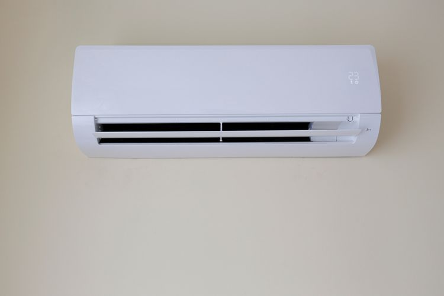
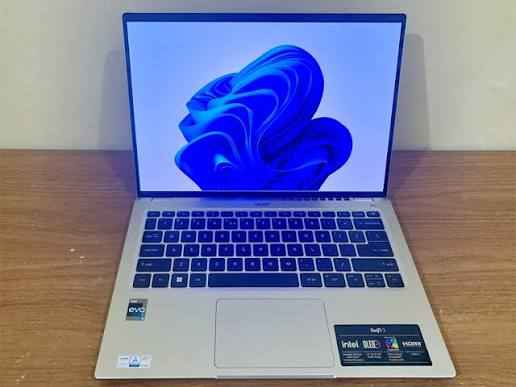
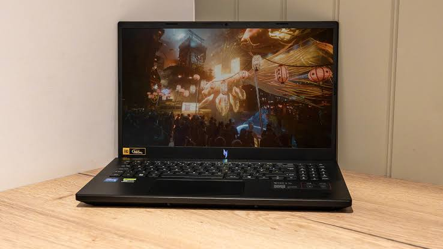

# Praktikum Pemrograman Berbasis Objek – Pertemuan 1  
##  Pengantar Konsep Pemrograman Berorientasi Objek


> Nama   : Muhammad Fauzi Fadillah
>
> NIM    : 254107020085
>
> Kelas  : TI_2G

---

# 3. Percobaan

## 3.1 Percobaan 1

Kode program Bike.java:
```java
package BikeDemo;

public class Bike {
    private String brand;
    private int speed;
    private int gear = 1;

    private final int[] GEAR_SPEED_LIMITS = {5, 10, 25, 30, 40, 60};
    
    public void setBrand(String brandName){
        brand = brandName;
    }

    public void gearChanges(int gearValue){
        if(gearValue < 1 || gearValue > 6) {
            System.out.println("Invalid gear value. Gear must be between 1 and 6.");
        }else {
            gear = gearValue;
        }
    }

    public int speedAcceleration(int increment){
        speed += increment;
        if(speed > GEAR_SPEED_LIMITS[gear - 1]){
            speed = GEAR_SPEED_LIMITS[gear - 1];
        }

        return speed;
    }

    public int speedDeceleration(int decrement){
        speed -= decrement;
        if(speed < 0){
            speed = 0;
        }

        return speed;
    }

    public void printInfo(){
        System.out.println("Brand : " + brand);
        System.out.println("Speed : " + speed);
        System.out.println("Gear : " + gear + "\n");
    }
}

```

Kode program BikeDemo.java:
```java
package BikeDemo;

public class BikeDemo {
    public static void main(String[] args) {
        Bike mountainBike1 = new Bike();
        Bike mountainBike2 = new Bike();

        mountainBike1.setBrand("Trek");
        mountainBike1.speedAcceleration(10);
        mountainBike1.gearChanges(2);
        mountainBike1.printInfo();

        mountainBike2.setBrand("Giant");
        mountainBike2.speedAcceleration(20);
        mountainBike2.gearChanges(3);
        mountainBike2.printInfo();
    }
}

```

Hasil program:
```java
Brand : Trek
Speed : 5
Gear : 2

Brand : Giant
Speed : 5
Gear : 3
```

---

## 3.2 Percobaan 2

Kode program RoadBike.java:

```java
package BikeDemo;

public class RoadBike extends Bike {
    private int tireWidth;

    public void setTireWidth(int width){
        tireWidth = width;
    }

    @Override
    public void printInfo() {
        super.printInfo();
        System.out.println("Tire Width : " + tireWidth + " mm");
        System.out.println("Bike Type  : Road Bike");
    }
}

```

Update kode program BikeDemo.java:
```java
package BikeDemo;

public class BikeDemo {
    public static void main(String[] args) {
        Bike mountainBike1 = new Bike();
        Bike mountainBike2 = new Bike();
        RoadBike roadBike1 = new RoadBike();

        mountainBike1.setBrand("Trek");
        mountainBike1.speedAcceleration(10);
        mountainBike1.gearChanges(2);
        mountainBike1.printInfo();

        mountainBike2.setBrand("Giant");
        mountainBike2.speedAcceleration(20);
        mountainBike2.gearChanges(3);
        mountainBike2.printInfo();

        roadBike1.setBrand("Specialized");
        roadBike1.setTireWidth(25);
        roadBike1.speedAcceleration(15);
        roadBike1.gearChanges(4);
        roadBike1.printInfo();
    }
}

```

Hasil program:
```java
Brand : Trek
Speed : 5
Gear : 2

Brand : Giant
Speed : 5
Gear : 3

Brand : Specialized
Speed : 5
Gear : 4

Tire Width : 25 mm
Bike Type  : Road Bike
```


---

## 5. Pertanyaan


### 1. Jelaskan perbedaan antara object dengan class!

Object merupakan hasil dari rancangan berupa class yang memiliki atribut dan juga method-methodnya. Sedangkan class merupakan blueprint untuk hasil/produk yang berupa Object

### 2. Jelaskan alasan gear dan brand dapat menjadi atribut dari object Bike!

Karena gear dan brand merupakan atribut dari class Bike yang mendefinisikan Bike yang memiliki brand apa dan juga sedang ada di gear berapa

### 3. Sebutkan salah satu kelebihan utama dari pemrograman berorientasi objek dibandingkan dengan pemrograman prosedural!

Dengan konsep PBO, saat ingin membuat suatu objek dengan jumlah yang banyak, maka cukup menggunakan konsep tersebut. Tidak perlu mendefinisikan tipe data setiap objeknya, karena sudah ada class yang menjadi blueprint untuk objek-objek yang akan dibuat

### 4. Apakah diperbolehkan melakukan pendefinisian dua buah atribut dalam satu baris kode seperti “public String nama, alamat;”?

Di java diperbolehkan

### 5. Pada class RoadBike, jelaskan alasan atribut brand, speed, dan gear tidak lagi ditulis di dalam class tersebut! 

Atribut-atribut tersebut tidak perlu ditulis lagi karena class RoadBike extends ke class Bike yang dimana menggunakan konsep inheritance(pewarisan), yaitu mewariskan atribut nya ke class lain yang lebih spesifik yaitu RoadBike. Tujuannya karena RoadBike merupakan jenis sepeda yang hampir sama dengan sepeda umumnya tetapi ada atribut atau bagian yang ditambahkan seperti lebar ban.


---


# 6. Tugas Praktikum


## Foto objek  

1. AC
- 

2. Handphone
- 

3. Laptop Acer Swift
- 

4. Laptop Acer Nitro
- 


## Program  

Kode program AC.java:
```java
package BikeDemo;

public class AC {
    public String merk;
    public int suhuCelcius;

    public void nyalakan() {
        System.out.println("AC " + merk + " dinyalakan.");
    }
    public void ubahSuhu(int suhuBaru) {
        suhuCelcius = suhuBaru;
        System.out.println("Suhu AC diubah menjadi " + suhuCelcius + " derajat Celcius.");
    }
    public void cetakInformasi() {
        System.out.println("--- Info AC ---");
        System.out.println("Merk : " + merk);
        System.out.println("Suhu : " + suhuCelcius + "C\n");
    }
}

```

Kode program Handphone.java:
```java
package BikeDemo;

public class Handphone {
    public String merk;
    public int persenBaterai;

    public void nyalakan() {
        System.out.println("Handphone " + merk + " menyala.");
    }
    public void isiDaya(int persen) {
        persenBaterai += persen;
        System.out.println("Mengisi daya... Baterai sekarang " + persenBaterai + "%.");
    }
    public void cetakInformasi() {
        System.out.println("--- Info Handphone ---");
        System.out.println("Merk    : " + merk);
        System.out.println("Baterai : " + persenBaterai + "%\n");
    }
}
```

Kode program Laptop.java:
```java
package BikeDemo;

public class Laptop {
    public String merk;
    public String sistemOperasi;

    public void nyalakan() {
        System.out.println("Laptop " + merk + " booting OS " + sistemOperasi + "...");
    }
    public void installSoftware(String software) {
        System.out.println("Menginstal " + software + " pada laptop " + merk + ".");
    }
    public void cetakInformasi() {
        System.out.println("Merk Laptop : " + merk);
        System.out.println("OS          : " + sistemOperasi);
    }
}
```

Kode program AcerSwift.java:
```java
package BikeDemo;

public class AcerSwift extends Laptop {
    public String warna;
    public double beratKg;

    public void aktifkanFingerprint() {
        System.out.println("Sensor sidik jari diaktifkan. Login berhasil.");
    }
    public void chargeTypeC() {
        System.out.println("Mengisi daya laptop menggunakan port Type-C.");
    }
    @Override
    public void cetakInformasi() {
        System.out.println("--- Info Laptop Tipis ---");
        super.cetakInformasi();
        System.out.println("Warna       : " + warna);
        System.out.println("Berat       : " + beratKg + " Kg\n");
    }
}
```

Kode program AcerNitro.java:
```java
package BikeDemo;

public class AcerNitro extends Laptop {
    public String kartuGrafis;
    public boolean rgbAktif;

    public void nyalakanKipasMaksimal() {
        System.out.println("Kipas pendingin menyala dalam kecepatan maksimal!");
    }
    public void mainGame(String game) {
        System.out.println("Memainkan game " + game + " dengan lancar menggunakan " + kartuGrafis + ".");
    }
    @Override
    public void cetakInformasi() {
        System.out.println("--- Info Laptop Gaming ---");
        super.cetakInformasi(); 
        System.out.println("GPU         : " + kartuGrafis);
        System.out.println("RGB Aktif   : " + rgbAktif + "\n");
    }
}
```


Kode program PraktikumDemo.java:
```java
package BikeDemo;

public class PraktikumDemo {
    public static void main(String[] args) {
        Handphone hp1 = new Handphone();
        hp1.merk = "Samsung";
        hp1.persenBaterai = 45;

        AC ac1 = new AC();
        ac1.merk = "Panasonic";
        ac1.suhuCelcius = 24;

        Laptop laptopUmum = new Laptop();
        laptopUmum.merk = "Laptop Generic";
        laptopUmum.sistemOperasi = "Windows 10";

        AcerSwift swift3 = new AcerSwift();
        swift3.merk = "Acer Swift 3";
        swift3.sistemOperasi = "Windows 11";
        swift3.warna = "Silver";
        swift3.beratKg = 1.2;

        AcerNitro nitroV15 = new AcerNitro();
        nitroV15.merk = "Acer Nitro V15";
        nitroV15.sistemOperasi = "Windows 11";
        nitroV15.kartuGrafis = "NVIDIA RTX 4050";
        nitroV15.rgbAktif = true;

        hp1.nyalakan();
        hp1.isiDaya(20);
        hp1.cetakInformasi();

        ac1.nyalakan();
        ac1.ubahSuhu(18);
        ac1.cetakInformasi();

        laptopUmum.nyalakan();
        laptopUmum.installSoftware("Microsoft Office");
        laptopUmum.cetakInformasi();
        System.out.println();

        swift3.nyalakan();
        swift3.aktifkanFingerprint();
        swift3.chargeTypeC();
        swift3.cetakInformasi();

        nitroV15.nyalakan();
        nitroV15.nyalakanKipasMaksimal();
        nitroV15.mainGame("Cyberpunk 2077");
        nitroV15.cetakInformasi();
    }
}

```


Hasil program praktikum:
```java
Handphone Samsung menyala.
Mengisi daya... Baterai sekarang 65%.
--- Info Handphone ---
Merk    : Samsung
Baterai : 65%

AC Panasonic dinyalakan.
Suhu AC diubah menjadi 18 derajat Celcius.
--- Info AC ---
Merk : Panasonic
Suhu : 18C

Laptop Laptop Generic booting OS Windows 10...
Menginstal Microsoft Office pada laptop Laptop Generic.
Merk Laptop : Laptop Generic
OS          : Windows 10

Laptop Acer Swift 3 booting OS Windows 11...
Sensor sidik jari diaktifkan. Login berhasil.
Mengisi daya laptop menggunakan port Type-C.
--- Info Laptop Tipis ---
Merk Laptop : Acer Swift 3
OS          : Windows 11
Warna       : Silver
Berat       : 1.2 Kg

Laptop Acer Nitro V15 booting OS Windows 11...
Kipas pendingin menyala dalam kecepatan maksimal!
Memainkan game Cyberpunk 2077 dengan lancar menggunakan NVIDIA RTX 4050.
--- Info Laptop Gaming ---
Merk Laptop : Acer Nitro V15
OS          : Windows 11
GPU         : NVIDIA RTX 4050
RGB Aktif   : true
```
